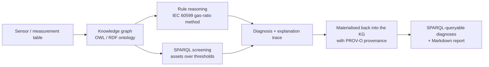

# Root Cause Analysis in the Industrial Domain using Knowledge Graphs

<p align="center">
  <a href="LICENSE"></a>
  <a href="https://www.python.org/"></a>
  <a href="https://doi.org/10.1016/j.procs.2022.01.304"></a>
  <a href="https://github.com/jorge-martinez-gil/root-cause-analysis/stargazers"></a>
</p>

**Explainable, knowledge-graph-based root cause analysis for industrial fault diagnosis and predictive maintenance.**
This repository turns dissolved-gas and oil-quality measurements from power transformers into traceable
root-cause diagnoses using an **OWL/RDF ontology**, **SPARQL** screening, **standards-grounded rule reasoning**
(IEC 60599 / IEEE C57.104), and **W3C PROV-O provenance** — so every conclusion comes with a complete
explanation trace instead of a black-box score.

> **Published in:** *Procedia Computer Science*, vol. 200, pp. 944–953, 2022 (Elsevier)
> **Citation:** Martinez-Gil, J., Buchgeher, G., Gabauer, D., Freudenthaler, B., Filipiak, D., & Fensel, A. (2022). Root Cause Analysis in the Industrial Domain using Knowledge Graphs: A Case Study on Power Transformers. *Procedia Computer Science*, 200, 944–953. https://doi.org/10.1016/j.procs.2022.01.304

---

## What problem does this solve?

Industrial assets such as **power transformers** are monitored with dozens of sensors (dissolved gases, oil
quality, health indices). Turning those numbers into an actionable *root cause* — *which* fault, *why*, and
*what to do* — usually relies either on expert manual analysis or on black-box machine-learning classifiers
that cannot justify their output. In safety-critical settings, an unexplained "failure" prediction is hard to
trust and hard to act on.

This project models assets, sensors, measurements, symptoms, faults, causes and maintenance actions in a
**knowledge graph**, and applies **documented diagnostic rules** to infer the root cause. Because the reasoning
is symbolic, every diagnosis is **explainable by construction**.

### Why knowledge graphs (and not a black box)?

| Challenge | Black-box ML | This approach |
|-----------|--------------|---------------|
| Trust / auditability | Opaque score | Every diagnosis traces to a rule + the exact evidence |
| Siloed sensor data | Feature vectors | Unified OWL/RDF graph linking assets → measurements → faults |
| Domain standards | Re-learned from data | Encodes IEC 60599 / IEEE C57.104 directly |
| Provenance | None | W3C PROV-O links each inferred triple to its rule and inputs |
| Cold start | Needs labelled failures | Works from published engineering rules, no training data |

---

## How it works



1. **Build the graph.** Measurements are materialised as RDF individuals against a consistent, fully documented TBox (`data/ontology/onto_pw.ttl`).
2. **Screen with SPARQL.** Find assets that exceed configurable thresholds (e.g. low health index).
3. **Reason with rules.** The **IEC 60599 basic gas-ratio method** classifies the dominant fault (PD, D1, D2, T1, T2, T3); advisory oil-quality rules add supporting symptoms.
4. **Explain and trace.** Each diagnosis records which rules fired and the exact evidence, and is written back into the graph with **PROV-O** so it can be queried and audited.

### Example explanation trace

```
Asset PW101 — status: Action required
  Root cause(s): T2 — Thermal fault, 300 °C ≤ t ≤ 700 °C
  [IEC60599-DGA] IEC 60599 basic gas-ratio method → T2: Thermal fault, 300 °C ≤ t ≤ 700 °C (severity: major; source: IEC 60599:2015, basic gas-ratio method (Table 1))
        • significant gases = 5 exceed IEC 60599 typical  (gases above typical: H2, CH4, C2H6, C2H4, C2H2)
        • R1 = C2H2/C2H4 = 0.0004196
        • R2 = CH4/H2 = 2.603
        • R5 = C2H4/C2H6 = 3.052
        action: Investigate moderate overheating; inspect cooling system, joints and circulating currents.
  Duval Triangle 1 coordinates: %CH4=30.7, %C2H4=69.2, %C2H2=0.0
```

---

## Installation

```bash
python -m pip install -e .
```

## Quickstart

Diagnose the built-in sample fleet and print explanation traces:

```bash
rca-diagnose
```

## Reproduce the published case study (one command)

```bash
rca-diagnose --output-dir ./rca_outputs --format markdown
```

This writes:
- `rca_outputs/diagnosis_report.md` — a Markdown report with a summary table and per-asset explanation traces.
- `rca_outputs/knowledge_graph.ttl` — the full RDF knowledge graph including the inferred diagnoses and PROV-O provenance.

## Diagnose a new industrial system

Provide a CSV with one row per asset. Recognised columns include the dissolved gases
`Hydrogen, Methane, Ethane, Ethylene, Acetylene` (μL/L) and oil-quality fields
`Water content, Dielectric rigidity, Interfacial V, Health index`. An optional `Asset` column sets the IDs.

```bash
rca-diagnose --input my_transformers.csv --output-dir ./out
```

Screen a fleet with SPARQL:

```bash
rca-query --input my_transformers.csv --parameter "Health index" --operator "<" --threshold 80
```

## Python API

```python
from root_cause_analysis import diagnose, build_diagnosed_graph, sample_transformer_measurements

measurements = sample_transformer_measurements()

for d in diagnose(measurements):
    print(d.asset_id, d.status, d.root_causes)
    print(d.explanation())

# Knowledge graph with inferred diagnoses + PROV-O provenance:
graph, diagnoses = build_diagnosed_graph(measurements)
graph.serialize("kg.ttl", format="turtle")
```

---

## Extending the platform

**Add a new fault scenario.** Drop measurements into a CSV (see above) or add a labelled signature to
`src/root_cause_analysis/datasets.py::reference_fault_signatures`, which is also used as a regression test for
the classifier.

**Write new rules.** The executable rules live in `src/root_cause_analysis/rules.py`; their specification (the
IEC 60599 case table and the advisory screening rules, with SWRL serialisations) is documented in
`data/rules/swrl_rules.md`. Screening rules are simple `DiagnosticRule` objects with an `evaluate` callback that
returns structured `Evidence`.

**Validate / regenerate the ontology.** The schema is generated from code, so it is always internally
consistent (every property used by the reasoner is declared, every class is documented):

```bash
rca-build-ontology --output-dir data/ontology   # regenerate onto_pw.ttl / .owl
pytest tests/test_ontology.py                    # consistency + documentation checks
```

---

## Scientific scope and integrity

This repository is precise about what is standards-grounded versus advisory:

- **Root-cause classification** uses the **IEC 60599 / IEEE C57.104** basic gas-ratio method. The classifier is
  verified against known-correct synthetic signatures in `tests/test_reasoning.py`.
- **Oil-quality and health screening** rules are **advisory** with **configurable** thresholds; they are *not*
  presented as formal standard limits.
- When gas ratios match no IEC case the result is reported honestly as **ND (indeterminate)** rather than forced
  into a category.

No benchmark numbers, comparisons, or performance figures are fabricated anywhere in this repository.

---

## Project structure

```text
.
├── data/
│   ├── ontology/onto_pw.ttl / .owl   # generated TBox (schema), fully documented
│   └── rules/swrl_rules.md           # canonical rule specification (IEC 60599 + screening)
├── docs/                             # methodology, assumptions, usage, troubleshooting
├── examples/                         # runnable workflow scripts
├── src/root_cause_analysis/
│   ├── ontology.py                   # TBox builder + KG materialisation
│   ├── rules.py                      # IEC 60599 gas-ratio method + screening rules
│   ├── reasoning.py                  # explainable engine + PROV-O provenance + reporting
│   ├── querying.py                   # SPARQL screening helpers
│   ├── datasets.py                   # sample data + labelled reference signatures
│   └── cli.py                        # rca-diagnose / rca-query / rca-classify / rca-build-ontology
└── tests/                            # engine, provenance, ontology and query tests
```

---

## Documentation

- [Methodology](docs/methodology.md) — pipeline and design decisions
- [Data and model assumptions](docs/assumptions.md) — scope, units and limitations
- [Usage guide](docs/usage.md) — CLI and Python API reference
- [Troubleshooting](docs/troubleshooting.md) — common issues
- [Rule specification](data/rules/swrl_rules.md) — IEC 60599 case table + screening rules

## Development

```bash
python -m pip install -e .[dev]
ruff check . && ruff format --check . && mypy src && pytest
```

---

## Roadmap

This release establishes the explainable reasoning core. Planned next steps (contributions welcome):

- A full **benchmark suite** with metrics (top-k root-cause recall, false-alarm rate, explanation completeness) and baseline methods.
- **Synthetic fault generators** and additional asset types (motors, pumps, switchgear).
- **SHACL** validation profiles and an extended **SPARQL** query library.
- A **Duval Triangle** zone classifier as a cross-check to the gas-ratio method.
- Counterfactual explanations and interactive fault-propagation visualisations.

---

## Citing this work

If this repository or the associated paper is useful to your research, please cite:

```bibtex
@article{martinez2022root,
  title     = {Root cause analysis in the industrial domain using knowledge graphs:
               a case study on power transformers},
  author    = {Martinez-Gil, Jorge and Buchgeher, Georg and Gabauer, David and
               Freudenthaler, Bernhard and Filipiak, Dominik and Fensel, Anna},
  journal   = {Procedia Computer Science},
  volume    = {200},
  pages     = {944--953},
  year      = {2022},
  publisher = {Elsevier},
  doi       = {10.1016/j.procs.2022.01.304}
}
```

**APA** — Martinez-Gil, J., Buchgeher, G., Gabauer, D., Freudenthaler, B., Filipiak, D., & Fensel, A. (2022). Root cause analysis in the industrial domain using knowledge graphs: a case study on power transformers. *Procedia Computer Science*, *200*, 944–953. https://doi.org/10.1016/j.procs.2022.01.304

---

## Related work

This repository sits at the intersection of **knowledge graphs**, **semantic reasoning**, and **industrial AI /
predictive maintenance**. Relevant areas include ontology-based fault diagnosis, dissolved-gas analysis (IEC
60599 / IEEE C57.104), the Semantic Web Rule Language (SWRL) for industrial reasoning, and explainable AI (XAI)
for asset health management.

## License

Distributed under the MIT License. See [LICENSE](LICENSE).
