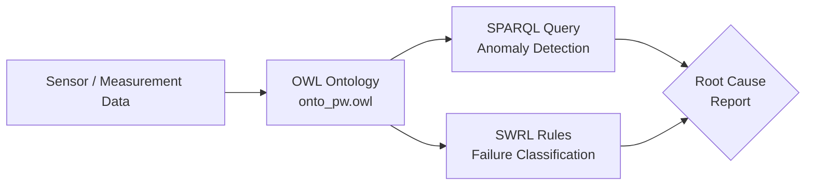

# Root Cause Analysis in the Industrial Domain using Knowledge Graphs

<p align="center">
  <a href="LICENSE"></a>
  <a href="https://www.python.org/"></a>
  <a href="https://doi.org/10.1016/j.procs.2022.01.304"></a>
  <a href="https://github.com/jorge-martinez-gil/root-cause-analysis/stargazers"></a>
</p>

> **Published in:** *Procedia Computer Science*, vol. 200, pp. 944–953, 2022 (Elsevier)  
> **Full citation:** Martinez-Gil, J., Buchgeher, G., Gabauer, D., Freudenthaler, B., Filipiak, D., & Fensel, A. (2022). Root Cause Analysis in the Industrial Domain using Knowledge Graphs: A Case Study on Power Transformers. *Procedia Computer Science*, 200, 944–953. https://doi.org/10.1016/j.procs.2022.01.304

---

## Overview

This repository provides the **research software** and **reproducible workflows** accompanying the above publication. It demonstrates a **knowledge graph-driven approach** to automated root cause analysis (RCA) for industrial assets — specifically high-voltage power transformers — combining:

- **Ontology-based asset modeling** (OWL/RDF)
- **SPARQL querying** for anomaly detection
- **SWRL rule-based classification** for failure diagnosis

The approach is **explainable by design**: every diagnostic decision traces back to an interpretable rule or ontology axiom, making it suitable for safety-critical industrial settings.

---

## Why this matters

| Challenge | Our approach |
|-----------|-------------|
| Black-box ML diagnostics | Fully interpretable rule & ontology reasoning |
| Siloed sensor data | Unified knowledge graph representation |
| Manual fault analysis | Automated SPARQL + SWRL classification pipeline |
| Reproducibility gap | Open data, open code, packaged module |

---

## System Architecture



---

## Key Contributions

1. **Knowledge graph schema** for power transformer diagnostics (OWL ontology with domain expert-validated concepts)
2. **SPARQL-based screening** of assets exceeding safety thresholds (e.g., dissolved water content)
3. **SWRL rule set** encoding IEC-standard diagnostic heuristics for failure/non-failure classification
4. **End-to-end reproducible pipeline** from raw measurements to actionable fault candidates
5. **Open benchmark** enabling direct comparison for future industrial KG-RCA methods

---

## Installation

```bash
python -m pip install -e .
```

For development and quality checks:

```bash
python -m pip install -e .[dev]
```

---

## Quickstart

```bash
python examples/minimal_quickstart.py
```

**Full industrial workflow** (reproduces the paper's case study):

```bash
python examples/industrial_workflow.py
```

Expected output includes:
- Transformers exceeding the water content threshold (e.g., `PW101`)
- Failure / non-failure candidate lists from the measurement table

---

## Project Structure

```text
.
├── data/ontology/onto_pw.owl       # Power transformer ontology (OWL)
├── docs/                           # Methodology, assumptions, usage guide
├── examples/                       # Runnable workflow scripts
├── src/root_cause_analysis/        # Packaged Python module
│   ├── classification.py           # SWRL-based rule classifier
│   ├── querying.py                 # SPARQL query engine wrapper
│   └── cli.py                      # rca-query / rca-classify entry points
├── tests/                          # Unit & integration tests
├── query.py                        # Standalone ontology query script
└── swrl-rules.py                   # Standalone rule classification script
```

---

## Documentation

- [Methodology](docs/methodology.md) — approach and design decisions
- [Data and model assumptions](docs/assumptions.md) — scope and limitations
- [Usage guide](docs/usage.md) — CLI and API reference
- [Troubleshooting](docs/troubleshooting.md) — common issues

---

## Development

Run the full quality suite locally:

```bash
ruff check .
ruff format --check .
mypy src
pytest
```

---

## Citing This Work

If this repository or the associated paper is useful to your research, please cite:

### BibTeX

```bibtex
@article{martinez2022root,
  title     = {Root cause analysis in the industrial domain using knowledge graphs:
               a case study on power transformers},
  author    = {Martinez-Gil, Jorge and Buchgeher, Georg and Gabauer, David and
               Freudenthaler, Bernhard and Filipiak, Dominik and Fensel, Anna},
  journal   = {Procedia Computer Science},
  volume    = {200},
  pages     = {944--953},
  year      = {2022},
  publisher = {Elsevier},
  doi       = {10.1016/j.procs.2022.01.304}
}
```

### APA

> Martinez-Gil, J., Buchgeher, G., Gabauer, D., Freudenthaler, B., Filipiak, D., & Fensel, A. (2022). Root cause analysis in the industrial domain using knowledge graphs: a case study on power transformers. *Procedia Computer Science*, *200*, 944–953. https://doi.org/10.1016/j.procs.2022.01.304

### ACM

> Jorge Martinez-Gil, Georg Buchgeher, David Gabauer, Bernhard Freudenthaler, Dominik Filipiak, and Anna Fensel. 2022. Root cause analysis in the industrial domain using knowledge graphs: a case study on power transformers. *Proc. Comput. Sci.* 200 (2022), 944–953. DOI: https://doi.org/10.1016/j.procs.2022.01.304

---

## Related Work

This repository sits at the intersection of **knowledge graphs**, **semantic reasoning**, and **industrial AI**. If you are building on related topics, you may also find the following areas relevant:

- Ontology-based fault diagnosis (IEC 61850 / IEC 61968)
- Semantic Web Rule Language (SWRL) for industrial reasoning
- Knowledge graph embeddings for anomaly detection
- Explainable AI (XAI) in predictive maintenance

---

## Roadmap

- [ ] Expand benchmark datasets and scenario coverage
- [ ] Add configurable rule profiles for additional industrial contexts (motors, switchgear)
- [ ] Provide richer explainability artifacts (rule traces, provenance graphs)
- [ ] Integration with SHACL constraint validation

---

## License

Distributed under the MIT License. See [LICENSE](LICENSE).
